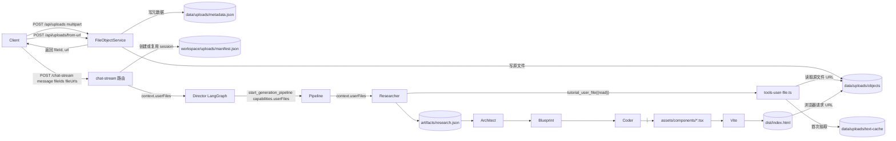

# interactive-tutorial 文件上传与多模态素材管线

本文档描述 `apps/interactive-tutorial` 业务域的文件上传能力，对应「让用户上传 PDF / Word / 图片等参考资料，让智能体基于这些资料生成互动教材」的需求。

---

## 1. 设计原则（与基座的关系）

- **基座零侵入**：所有新能力均位于 `apps/interactive-tutorial/` 下；不修改 `src/core/*`、`src/api/*`、`src/tools/built-in/*`、`src/utils/*` 中任何既有文件。复用基座 API：`workspaceManager.getPath`、`resolvePublicBaseUrl`、Fastify multipart、`/api/files/` 静态挂载、`dynamicToolRegistry`。
- **存储与抽取分离**：上传只生成用户级 FileObject；会话 manifest 只保存 fileId 绑定；正文抽取由 agent 工具按需触发，结果落 `data/uploads/text-cache/<fileId>.text` 缓存。
- **多模态用 URL 引用而非复制到 dist**：每个上传文件上传完即拥有 `/api/files/...` 永久 URL；Coder 直接 `` / `<a href=URL>`。`workspace-sync.ts` 不复制非 `.tsx/.ts` 文件是 feature。
- **抽取支持矩阵**：

| 类型 | MIME / 扩展名 | 实现 | 依赖 |
|---|---|---|---|
| 文本 | `text/*`, `application/json`, `.txt/.md/.csv/.tsv/.log/.json/.yaml/.yml/.html/.htm/.xml/.srt/.vtt` | 直接 utf-8 读 | 无 |
| PDF | `application/pdf`, `.pdf` | dynamic import `pdf-parse` v2（`new PDFParse({data}).getText()`） | `pdf-parse` |
| Word | `application/vnd.openxmlformats-officedocument.wordprocessingml.document`, `.docx` | dynamic import `mammoth.extractRawText` | `mammoth` |
| PowerPoint | `application/vnd.openxmlformats-officedocument.presentationml.presentation`, `.pptx` | dynamic import `officeparser.parseOffice` | `officeparser` |
| 图片/音/视频 | `image/*`, `audio/*`, `video/*` | 不抽取，标 `unreadable=true`，仅作为 URL 给 Coder 引用 | 无 |
| 其它 | — | 标 `unreadable=true`；后续可扩展 | — |

抽取上限：单文件 200_000 字符（截断），文档型解析硬上限 30MB（避免超大 PDF 把进程内存打爆）。每会话总上传额度 200MB（环境变量 `TUTORIAL_UPLOAD_QUOTA_MB` 可调）；单文件 50MB（Fastify multipart 全局限制）。

---

## 2. HTTP 端点

主流程已改为「无会话上传」：用户第一次调用智能体前没有 `sessionId`，所以本地文件和文件链接先进入用户级 FileObject；首次 `chat-stream` 创建 session 后再把 `fileIds` 绑定到该 session。

| 方法 | 路径 | 用途 |
|---|---|---|
| `POST` | `/api/uploads` | 通用 multipart 上传，不需要 `sessionId`。返回 `{ files: FileObjectSummary[], errors? }` |
| `POST` | `/api/uploads/from-url` | 导入远程 `http/https` 文件链接，服务端下载并归一化成 FileObject |
| `POST` | `/api/business/interactive-tutorial/chat-stream` | 首次无 `sessionId` 时创建 session，并绑定本次 `fileIds/fileUrls` |

文件实际下载继续走 `/api/files/...`（基座现成静态挂载，匿名可达——URL 即令牌；与 dist 预览策略一致）。

返回的每条 `UserFileSummary`：

```ts
{
  fileId: string;          // file_<uuid>
  name: string;            // 用户原始文件名
  mimeType: string;
  kind: "doc" | "image" | "audio" | "video" | "data" | "unknown";
  byteSize: number;
  url: string;             // 永久 /api/files/... URL
  textChars?: number;      // 已抽取过则有
  unreadable?: boolean;    // true 表示不适合作为正文读取
}
```

---

## 3. 完整 curl 示例

### 3.1 第一步：上传文件

```bash
curl -X POST 'http://192.168.50.117:3000/api/uploads' \
  -H 'Authorization: Bearer x-pilot-default-key' \
  -F 'file=@./电池安装手册.pdf'
```

响应：

```json
{
  "files": [
    {
      "fileId": "file_a3f1c829-...",
      "name": "电池安装手册.pdf",
      "mimeType": "application/pdf",
      "kind": "doc",
      "byteSize": 10485760,
      "url": "http://192.168.50.117:3000/api/files/uploads/objects/file_a3f1c829-....pdf"
    }
  ]
}
```

可立刻把 `url` 在浏览器打开验证，文件已在那儿。

也可以先导入文件链接：

```bash
curl -X POST 'http://192.168.50.117:3000/api/uploads/from-url' \
  -H 'Content-Type: application/json' \
  -H 'Authorization: Bearer x-pilot-default-key' \
  --data-raw '{"url":"https://example.com/电池安装手册.pdf"}'
```

### 3.2 第二步：首次用 fileIds 发起对话

```bash
curl -X POST 'http://192.168.50.117:3000/api/business/interactive-tutorial/chat-stream' \
  -H 'Content-Type: application/json' \
  -H 'Authorization: Bearer x-pilot-default-key' \
  --data-raw '{
    "message": "请基于附件资料生成一个动力电池管理系统及充电系统讲解的互动应用。",
    "databaseId": "",
    "smartSearch": 1,
    "fileIds": ["file_a3f1c829-..."]
  }'
```

首次调用可以不传 `sessionId`；服务端会创建新 session，并在 SSE 事件的 `session_id` 中返回。前端保存这个值，后续继续对话时再传 `sessionId`。

服务端会自动：
1. 若 `sessionId` 缺失，先创建 session。
2. 将 `fileUrls` 导入为 FileObject，并与 `fileIds` 一起绑定到当前 session。
3. 读取该 session 已绑定文件，生成 `context.userFiles[]`。
4. 在用户消息末尾追加一段 `【用户附件 N 份】` 列表（让 Director 看见但不读正文）。
5. 把摘要塞进 `streamAgentV2` 的 `context.userFiles[]`，自动出现在 Director 系统提示的 `# Task Context` 段。
6. Director 调用 `start_generation_pipeline` 时必须把它原样透传到 `capabilities.userFiles`（导演 TOOLS.md 已强制要求）。
7. Researcher 在它的 `# Task Context` 里看到这份清单，第一阶段并行调用 `tutorial_user_file({action:"read", fileId, maxChars})` 拉取正文。
8. 抽取结果写入 `data/uploads/text-cache/<fileId>.text` 缓存；后续 `read` 命中缓存（毫秒级）。
9. Researcher 在 `artifacts/research.json` 中：
   - 引用用户文件得出的 `keyPoints` 标 `source: "user_file"`；
   - 在顶层 `referencedAssets` 列出图片/PDF 等需要在最终 UI 中引用的素材，含 `fileId`/`url`/`role`/`alt`。
10. Coder 拿到蓝图 + research.json，对图片直接 ``；对 PDF 用 `<a href={URL} download>` 提供下载链接。**不**复制到 `dist/`。

---

## 4. 数据流图



注意：原始上传文件只在 `data/uploads/objects/` 保存一次；workspace 只保存绑定关系；dist 不复制、source 不复制；文本缓存只是抽取副本。

---

## 5. 安全与限制

- 鉴权：`/api/uploads`、`/api/uploads/from-url`、`/api/business/...` 路径走标准 `authMiddleware`（Bearer / `apiKey`）。文件实际下载 `/api/files/` 跳过鉴权，URL 即令牌（与 dist 预览一致）。
- MIME 黑名单：`application/x-msdownload`、`application/x-sh`、`application/x-bat`、`application/x-msi`、`application/x-msdos-program` 直接拒绝。
- 文件名内部化：磁盘真名 = `<fileId>.<safeExt>`，`safeExt` 由 mimeType 反查表 + 原扩展名校验得到（无效 → `bin`），避免路径穿越和奇异字符。
- 沙箱化访问：`tutorial_user_file` 工具只接受 `fileId`，不暴露任意路径；researcher 的 `agent.config.yaml.allowedTools` **已移除**通用 `file_read`，禁止读取任意磁盘文件。
- 配额：默认每会话 200MB（`TUTORIAL_UPLOAD_QUOTA_MB`），单文件 ≤50MB（multipart 全局），文档解析 ≤30MB。
- manifest 写并发：模块内 `Map<sessionKey, Promise>` 链式串行化，避免并发上传互相覆盖。

---

## 6. 已知边界 / 未来方向

- 当前未对图片做 OCR——若要让 researcher 「读懂」图片内容，可在 `extract.ts` 加 `image/*` 分支调用第三方 OCR/视觉模型。
- 未实现「自包含 zip 离线导出」：浏览器需要联网才能拿到 `` 指向的 URL。后续如果要交付一个自包含 zip，可以加一个 `/export` 端点，walk dist HTML 中所有 `/api/files/...` 引用，下载到 `dist/external/` 后重写引用、打包。
- 当前 `attachments: string` 字段保留兼容，路由完全不读；推荐迁移到 `fileIds`。

---

## 7. 文件 / 模块对应表

| 文件 | 作用 |
|---|---|
| [`apps/interactive-tutorial/code/uploads/types.ts`](../../apps/interactive-tutorial/code/uploads/types.ts) | manifest 数据模型 + `UserFileSummary` |
| [`apps/interactive-tutorial/code/uploads/paths.ts`](../../apps/interactive-tutorial/code/uploads/paths.ts) | 复用基座 `workspaceManager.getPath` + `resolvePublicBaseUrl` 算路径 |
| [`apps/interactive-tutorial/code/uploads/uploads-service.ts`](../../apps/interactive-tutorial/code/uploads/uploads-service.ts) | addFile / listFiles / getFile / deleteFile / cacheText / markUnreadable，含会话串行化 + 配额 + MIME 黑名单 |
| [`apps/interactive-tutorial/code/uploads/extract.ts`](../../apps/interactive-tutorial/code/uploads/extract.ts) | 文本/PDF/docx/pptx 抽取，全部 dynamic import |
| [`apps/interactive-tutorial/code/tools-user-file.ts`](../../apps/interactive-tutorial/code/tools-user-file.ts) | `tutorial_user_file({action,fileId,offset,maxChars})` 沙箱工具 |
| [`apps/interactive-tutorial/code/index.ts`](../../apps/interactive-tutorial/code/index.ts) | `dynamicToolRegistry.register("tutorial_user_file", createUserFileTool)` |
| [`apps/interactive-tutorial/code/types.ts`](../../apps/interactive-tutorial/code/types.ts) | `ChatRequest.fileIds` |
| [`apps/interactive-tutorial/code/routes.ts`](../../apps/interactive-tutorial/code/routes.ts) | 4 个 `/uploads` 端点 + chat-stream 注入 `context.userFiles` |
| [`apps/interactive-tutorial/code/tools.ts`](../../apps/interactive-tutorial/code/tools.ts) | `start_generation_pipeline.capabilities.userFiles` schema |
| [`apps/interactive-tutorial/code/generation-facade.ts`](../../apps/interactive-tutorial/code/generation-facade.ts) | 把 `capabilities.userFiles` 透传进 pipeline `context` |
| [`apps/interactive-tutorial/tutorial-content-researcher/agent.config.yaml`](../../apps/interactive-tutorial/tutorial-content-researcher/agent.config.yaml) | `allowedTools` 用 `tutorial_user_file` 替换 `file_read`；`outputFormat.schema` 加 `referencedAssets` |
| [`apps/interactive-tutorial/tutorial-content-researcher/{TOOLS.md,MISSION.md}`](../../apps/interactive-tutorial/tutorial-content-researcher/) | 工具用法 + 必读约束 |
| [`apps/interactive-tutorial/interactive-tutorial-director/TOOLS.md`](../../apps/interactive-tutorial/interactive-tutorial-director/TOOLS.md) | 强制透传 `context.userFiles` 到 `capabilities.userFiles` |
| [`apps/interactive-tutorial/tutorial-coder/TOOLS.md`](../../apps/interactive-tutorial/tutorial-coder/TOOLS.md) | 「用户素材引用约定」一节，强制 URL 引用而非复制 |
| [`scripts/smoke-user-file.mjs`](../../scripts/smoke-user-file.mjs) | 直跑 `tutorial_user_file` 工具的本地烟雾测试脚本 |
